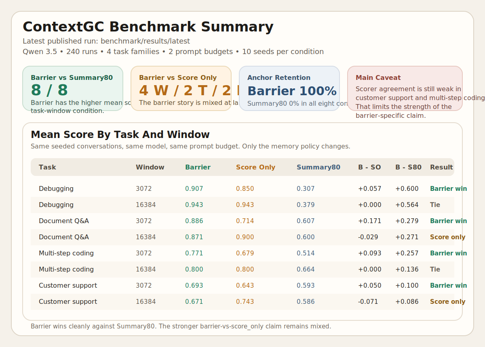

# ContextGC Barrier

ContextGC Barrier is a small research repo about a narrow question:

When a conversation gets too long for the prompt window, which old messages should survive?

The repo compares three strategies:

- `summary80`
- `barrier`
- `summary80_barrier`

It is not trying to solve "general AI memory." It is trying to measure exact context retention under pressure.



## In One Minute

If you only want the headline:

- `summary80` is the lossy baseline.
- `barrier` keeps the right raw older messages and clearly beats `summary80` on the current debugging replay benchmark.
- `summary80_barrier` is a reasonable hybrid, but on the current replay it does not beat plain `barrier`.

## The Three Strategies

### `summary80`

This is the simple baseline.

- When the prompt gets close to the usable budget, older context is compressed into one rolling summary.
- The prompt becomes: system prompt + rolling summary + recent raw tail.
- This saves tokens, but it can blur or drop exact old facts.

### `barrier`

This is the raw-context retention path.

- It keeps the latest user request and recent context.
- It scores older raw messages against the current task.
- If the model appears to rely on an older `user` or `tool` message, that message gets citation/protection weight and is harder to evict later.

### `summary80_barrier`

This is the hybrid.

- It starts with the same rolling summary flow as `summary80`.
- Then it adds back raw protected exceptions for older `user` and `tool` messages that were cited or protected.
- In plain English: summarize the boring parts, but keep the exact raw anchors when they have already proved important.

## What The Benchmark Is Actually Testing

The main benchmark question is simple:

If the model, prompt budget, and conversation are all fixed, which retention policy keeps the right old facts alive?

There are two benchmark styles:

- `matrix`: live multi-turn tasks for debugging, document QA, coding, and support
- `debugging_replay`: a scripted debugging replay benchmark where every strategy sees the exact same frozen transcript

The replay benchmark is the cleaner proof benchmark because only the retention policy changes.

## Runtime Notes

The shared runtime is [ContextGCBarrier](/Users/pradeepsingh/code/contextgc_poc/contextgc_barrier/wrapper.py).

Valid strategy ids are:

- `summary80`
- `barrier`
- `summary80_barrier`

`barrier` stays the default for backward compatibility.

The runtime now reports summary-specific metadata in `context_state()`:

- `summary_active`
- `summarized_through_index`
- `summary_tokens`
- `protected_exception_indexes`

For summary strategies, `selected_messages` contains only raw source messages. The synthetic rolling summary is used in the actual prompt, but it is not reported as a fake source message.

## Repository Layout

- [contextgc_barrier](/Users/pradeepsingh/code/contextgc_poc/contextgc_barrier): runtime selection, scoring, citation barrier, summary logic, local demo
- [benchmark](/Users/pradeepsingh/code/contextgc_poc/benchmark): task generation, matrix runner, replay runner, stats, CLI
- [tests](/Users/pradeepsingh/code/contextgc_poc/tests): unit and integration coverage
- [spec.md](/Users/pradeepsingh/code/contextgc_poc/spec.md): plain-English benchmark framing

## Setup

```bash
python3 -m venv .venv
source .venv/bin/activate
python -m pip install -U pip
python -m pip install -e ".[dev]"
```

For live local Qwen runs on Apple Silicon:

```bash
python -m pip install -e ".[mlx]"
```

Optional spaCy model:

```bash
python -m spacy download en_core_web_sm
```

## Quick Start

Run the local demo for one strategy:

```bash
python -m contextgc_barrier.demo --strategy barrier
```

Run the small proof profile:

```bash
./.venv/bin/python benchmark/run_benchmark.py \
  --profile proof \
  --window-budget 3072
```

Run the scripted debugging replay smoke benchmark:

```bash
./.venv/bin/python benchmark/run_benchmark.py \
  --profile debugging_replay_smoke \
  --output-dir benchmark/results/debugging_replay_smoke
```

Run the full scripted debugging replay benchmark:

```bash
./.venv/bin/python benchmark/run_benchmark.py \
  --profile debugging_replay \
  --output-dir benchmark/results/debugging_replay
```

Run the full task matrix:

```bash
./.venv/bin/python benchmark/run_benchmark.py \
  --profile matrix \
  --strategies summary80,barrier,summary80_barrier
```

## Replay Artifacts

The replay benchmark writes:

- `transcripts.jsonl`: the frozen scripted transcripts
- `runs.jsonl`: one run per transcript/window/strategy
- `aggregate.json` and `aggregate.csv`: grouped metrics
- `summary.md`: human-readable summary
- `audit_queue.jsonl`: rows flagged for manual review
- `progress.log`: corpus-generation and evaluation progress

The scripted replay assistant turns are intentionally non-answer-bearing. They can refer back to the earlier incident, but they do not restate the scored anchor aliases. That keeps the replay benchmark focused on retention instead of giving the model late copies of the answer.

## Current Replay Result

Latest full run: [summary.md](/Users/pradeepsingh/code/contextgc_poc/benchmark/results/debugging_replay/summary.md)

This is the current benchmark to read. It uses `20` frozen debugging transcripts, `3` strategies, and `3` prompt windows.

```mermaid
xychart-beta
    title "Debugging Replay Mean Score"
    x-axis [3072, 4096, 16384]
    y-axis "Score" 0 --> 1.0
    bar "summary80" [0.211, 0.200, 0.825]
    bar "barrier" [0.829, 0.818, 0.825]
    bar "summary80_barrier" [0.786, 0.793, 0.825]
```



| Window | `summary80` | `barrier` | `summary80_barrier` | Honest read |
|---:|---:|---:|---:|---|
| `3072` | `0.211` | `0.829` | `0.786` | `barrier` is clearly best. The hybrid beats summary but still trails raw retention. |
| `4096` | `0.200` | `0.818` | `0.793` | Same result. `barrier` stays ahead. |
| `16384` | `0.825` | `0.825` | `0.825` | Once the full transcript fits, the strategies tie. |

The paired comparisons in [summary.md](/Users/pradeepsingh/code/contextgc_poc/benchmark/results/debugging_replay/summary.md) support this reading:

| Comparison | `3072` | `4096` | What to say publicly |
|---|---|---|---|
| `barrier` vs `summary80` | delta `+0.618`, wins `20/20`, `p=0.000` | delta `+0.618`, wins `20/20`, `p=0.000` | `barrier` clearly beats `summary80` on this debugging replay benchmark. |
| `summary80_barrier` vs `barrier` | delta `-0.043`, `p=0.388` | delta `-0.025`, `p=1.000` | The hybrid does not beat plain `barrier` on this benchmark. |

So the strongest supported claim is still the simple one:

Keeping the right raw context beats replacing old context with a lossy rolling summary.

## Audit Check

I checked the `24` flagged rows in [audit_queue.jsonl](/Users/pradeepsingh/code/contextgc_poc/benchmark/results/debugging_replay/audit_queue.jsonl) against [runs.jsonl](/Users/pradeepsingh/code/contextgc_poc/benchmark/results/debugging_replay/runs.jsonl).

| Audit finding | Count | What it means |
|---|---:|---|
| `contamination` | `17` | Mostly `summary80` pulling stale side-case facts under tight budgets. This strengthens the main benchmark story. |
| `scorer_disagreement` | `4` | Small parser misses, mainly around `remediation` or `file_line`, not a new benchmark failure mode. |
| `random_sample` | `3` | Spot-check rows chosen for manual review; no new issue pattern found. |

| Strategy | Flagged rows | Contamination | Scorer disagreement |
|---|---:|---:|---:|
| `summary80` | `15` | `14` | `1` |
| `barrier` | `6` | `2` | `2` |
| `summary80_barrier` | `3` | `1` | `1` |

Manual read of the flagged rows says the benchmark is publishable with one honest caveat: a few rows still depend on scorer interpretation, so the claim should stay narrow and benchmark-specific.

## What Not To Claim

- Do not say this proves a general memory system.
- Do not say the hybrid is better than `barrier`; it is not, on the current replay.
- Do not say this is production proof. It is a strong benchmark result, not a deployment study.

The repo no longer treats `score_only`, `recency`, or `full_history` as active benchmark strategies.

## Publish Set

For a clean public repo, treat [benchmark/results/debugging_replay](/Users/pradeepsingh/code/contextgc_poc/benchmark/results/debugging_replay) as the current result set.
